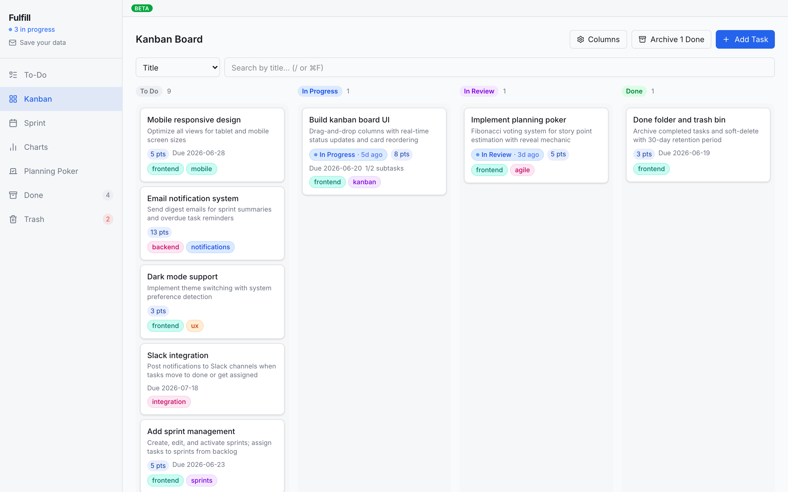

# Fulfill

A project-management app for planning and tracking work — Kanban, sprints, story-point
estimation, and analytics — built as a local-first web app that works with **no account
required** and seamlessly syncs to the cloud once you sign in.

**Live app: [fulfill.paperalien.com](https://fulfill.paperalien.com)** &nbsp;·&nbsp; *(currently in beta)*

> Try it instantly — the app loads straight into a usable state with your data stored locally in
> the browser. Add an email only when you want to sync across devices.

<!-- Add screenshots here for the strongest first impression, e.g.:

-->

## Features

- **Kanban board** — drag-and-drop columns with semantic status (not started / in progress / done)
- **To-Do list & Sprints** — organize tasks into sprints, track velocity
- **Planning Poker** — Fibonacci story-point estimation
- **Charts** — burndown and progress analytics
- **Tasks with depth** — subtasks, predecessors/blockers, tags, recurrence, reminders, notes
- **Done Folder & Trash** — archive completed work; soft-delete with 30-day retention
- **Local-first, account-optional** — full functionality offline in `localStorage`; opt in to a
  passwordless email (OTP) account to sync. Local data migrates to the server on first sign-in
  with nothing lost.
- **Workspaces** — a personal workspace per user (shared/multi-user workspaces are on the roadmap)

## Tech Stack

| Layer | Technology |
|-------|-----------|
| Frontend | React 19, Vite 7, TypeScript, Tailwind CSS v4, Radix UI, TanStack Query |
| Backend | Express 5, TypeScript |
| Database | PostgreSQL, Drizzle ORM (typed schema + migrations) |
| Auth | Supabase (passwordless email OTP; JWTs verified locally with `jose`) |
| API contract | OpenAPI spec as the source of truth → Orval generates the typed client + Zod validators |
| Tooling | pnpm workspaces, Vitest, Prettier |
| Hosting / CI | Fly.io, GitHub Actions (typecheck · tests · API-drift & schema checks · deploy) |

## Architecture Highlights

A few decisions worth calling out:

- **Spec-driven, type-safe end to end.** `lib/api-spec/openapi.yaml` is the single source of truth.
  Orval codegen produces the React Query hooks (`lib/api-client-react`) and the Zod request
  validators (`lib/api-zod`), so the client, server validation, and types can't silently drift —
  and CI fails the build if an endpoint in code doesn't match the spec.
- **Local-first by design.** `TaskContext` is storage-agnostic: the same interface reads/writes
  `localStorage` when anonymous and the API when authenticated, so the UI never branches on auth
  state. Signing in migrates local data to the server in dependency order (columns → sprints →
  tasks), remapping IDs, and only clears local data after a successful upload.
- **Defense-in-depth auth.** Authorization is enforced in the Express API (which connects as the
  DB owner). Because Supabase auto-exposes every table over PostgREST with the public anon key,
  Row Level Security is enabled with **no policies** on every table — a deliberate deny-all that
  closes the PostgREST door while the owner-role API is unaffected.
- **Migration discipline.** Local iteration uses `drizzle-kit push`; production applies committed
  migration files via `drizzle-kit migrate` on deploy — never `push` against prod.

For the full picture see [`docs/production-deployment.md`](docs/production-deployment.md) and the
project [`CLAUDE.md`](CLAUDE.md).

## Monorepo Layout

```
artifacts/
  api-server/        # Express 5 REST API (port 3000)
  pm-app/            # React 19 + Vite SPA (port 5173)
lib/
  api-spec/          # openapi.yaml + Orval config (source of truth)
  api-zod/           # generated Zod validators (do not edit)
  api-client-react/  # generated React Query hooks (do not edit)
  db/                # Drizzle schema, migrations, connection
scripts/             # CI checks (API drift, schema)
docs/                # deployment runbook + architecture notes
```

## Running Locally

**Prerequisites:** Node ≥ 22.13, pnpm 10.x, PostgreSQL 15, and a Supabase project (for auth).

```bash
pnpm install

# Configure environment (fill in your own values)
cp artifacts/api-server/.env.example artifacts/api-server/.env
cp artifacts/pm-app/.env.example     artifacts/pm-app/.env

# Sync the schema to your local database
pnpm -F @workspace/db run push

# Start the API (:3000) and the SPA (:5173) together
pnpm run dev
```

Then open http://localhost:5173. You can use the app immediately in local mode — no backend
auth needed until you choose to sign in.

## Testing & Quality Checks

```bash
pnpm -F @workspace/pm-app test   # Vitest unit tests
pnpm run typecheck               # Type-check every package
pnpm check:drift                 # Verify API routes match the OpenAPI spec
pnpm check:schema                # Verify DB schema consistency
```

All four run in CI on every pull request; a deploy to production only happens after they pass.

## License

[MIT](LICENSE) © Paperalien
