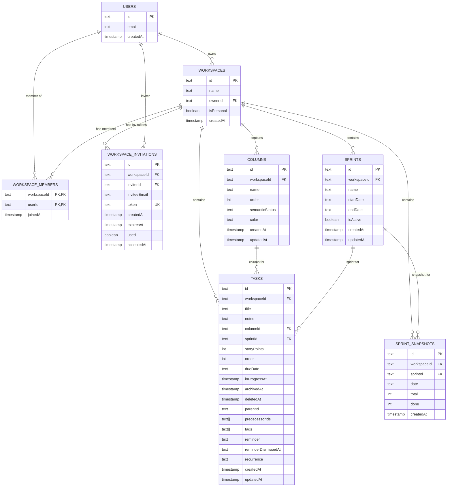
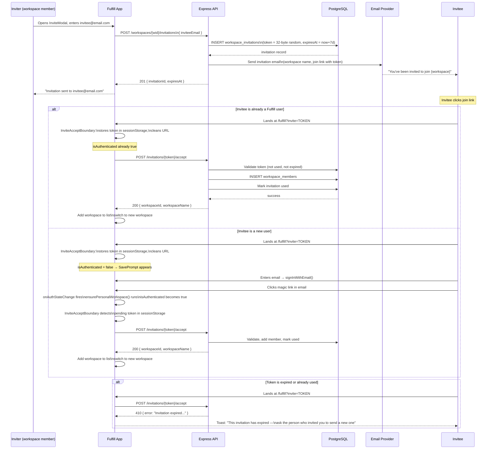
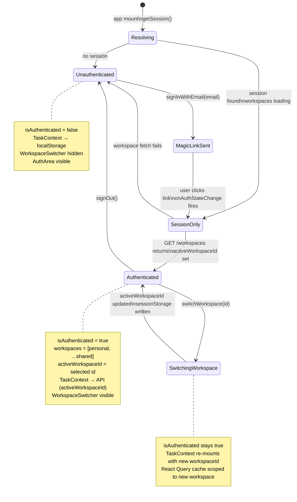
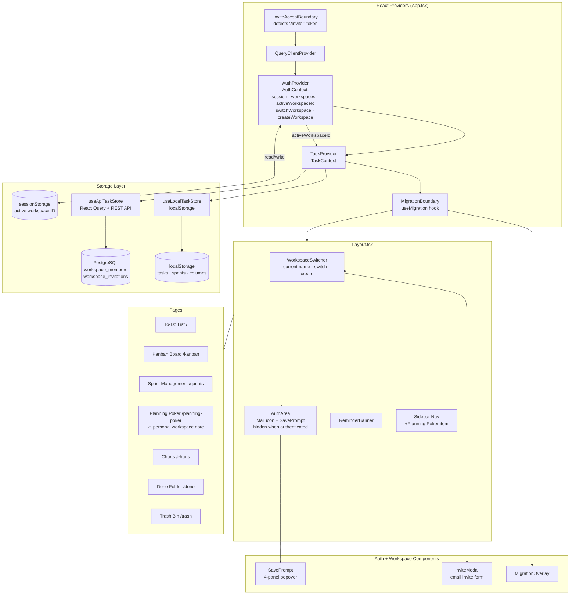

# Workspaces — Architecture & Implementation Plan

**Status:** Planning  
**Spec source:** `guidelines/Workspaces-Design.md`  
**Prepared:** 2026-05-17

## Executive Summary

Workspaces transforms Fulfill from a single-user personal productivity tool into a shared team collaboration platform. Every entity in the app — tasks, kanban columns, sprints, snapshots — already belongs to a workspace in the data model. Today each user has exactly one workspace and owns it exclusively. This feature introduces:

- **Multiple workspaces per user** — a user can be a member of any number of shared workspaces and switch between them freely.
- **Invitations** — any workspace member can invite others by email, whether or not the invitee is already a Fulfill user.
- **Planning Poker in the nav** — always visible; contextual messaging in Personal workspaces.

### Size of change

This is a **large, multi-week feature** spanning every layer of the stack:

| Layer | Change magnitude |
|---|---|
| Database | 2 new tables, 1 column added, 1 data backfill |
| Backend | 1 middleware rewrite, 7 new endpoints, email integration |
| OpenAPI + codegen | New spec entries, regenerated client + validators |
| Frontend | AuthContext restructured, 3 new components, 3 modified |

### Key risks

| Risk | Severity | Notes |
|---|---|---|
| Access control rewrite | **Critical** | Every API request currently checks ownership; switching to membership must be airtight |
| Data isolation | **Critical** | A member of workspace A must never read or write workspace B's data |
| Email sending infrastructure | **High** | Supabase only handles auth emails; a transactional email provider must be chosen before invitation work begins |
| DB backfill on deploy | **Medium** | Existing rows must be migrated before the new middleware goes live |
| Invitation token security | **Medium** | Tokens must be unguessable and expire correctly |

### Phasing summary

Ten phases, each independently shippable and verifiable before the next begins. Phases 1–2 are foundational and must complete before anything else.

---

## Current Architecture — Baseline

Before designing changes, it is important to understand exactly what exists today.

### Data model (current)

Every resource is scoped to a `workspace_id`. The `workspaces` table has a single `owner_id` column — one user owns each workspace.

### Access control (current)

`requireWorkspaceAccess` middleware (`artifacts/api-server/src/middlewares/requireWorkspaceAccess.ts`) queries:

```sql
SELECT owner_id FROM workspaces WHERE id = :workspaceId
```

It returns 403 if `owner_id ≠ req.user.id`. This is the single gate for all protected endpoints.

### Auth context (current)

`AuthContext` (`artifacts/pm-app/src/app/contexts/AuthContext.tsx`) exposes a single `workspaceId: string | null`. It is populated by `POST /workspaces/ensure-personal` on every login. `isAuthenticated = !!session && !!workspaceId`.

### Task context (current)

`TaskContext` (`artifacts/pm-app/src/app/contexts/TaskContext.tsx`) switches between `useLocalTaskStore` (localStorage) and `useApiTaskStore(workspaceId)` based on `isAuthenticated`. All pages consume this unified interface.

---

## Data Model Changes

### Modify: `workspaces` table

Add one column:

```typescript
// lib/db/src/schema/workspaces.ts
isPersonal: boolean('is_personal').notNull().default(false)
```

Personal workspaces cannot be renamed, cannot have invitations sent to them, and cannot be left. This flag is the authoritative source of that distinction.

### New table: `workspace_members`

```typescript
// lib/db/src/schema/workspaceMembers.ts
export const workspaceMembers = pgTable('workspace_members', {
  workspaceId: text('workspace_id').notNull().references(() => workspaces.id, { onDelete: 'cascade' }),
  userId:      text('user_id').notNull().references(() => users.id, { onDelete: 'cascade' }),
  joinedAt:    timestamp('joined_at', { withTimezone: true }).notNull().defaultNow(),
}, (t) => ({
  pk: primaryKey({ columns: [t.workspaceId, t.userId] }),
}));
```

### New table: `workspace_invitations`

```typescript
// lib/db/src/schema/workspaceInvitations.ts
export const workspaceInvitations = pgTable('workspace_invitations', {
  id:            text('id').primaryKey(),                // crypto.randomUUID()
  workspaceId:   text('workspace_id').notNull().references(() => workspaces.id, { onDelete: 'cascade' }),
  inviterId:     text('inviter_id').notNull().references(() => users.id, { onDelete: 'cascade' }),
  inviteeEmail:  text('invitee_email').notNull(),
  token:         text('token').notNull().unique(),       // 32-byte URL-safe random (base64url)
  createdAt:     timestamp('created_at', { withTimezone: true }).notNull().defaultNow(),
  expiresAt:     timestamp('expires_at', { withTimezone: true }).notNull(), // createdAt + 7 days
  used:          boolean('used').notNull().default(false),
  acceptedAt:    timestamp('accepted_at', { withTimezone: true }),
});
```

### Name uniqueness enforcement

A partial unique index on `workspaces.name` covering only non-personal workspaces enforces the global uniqueness rule without conflicting with the many Personal workspaces that share similar auto-generated names:

```sql
CREATE UNIQUE INDEX workspaces_name_shared_unique
  ON workspaces (name)
  WHERE is_personal = false;
```

This is expressed in Drizzle as a custom index in the table definition.

### Data backfill on deploy

**These SQL statements must run as part of the deploy, before the new `requireWorkspaceAccess` goes live:**

```sql
-- 1. Mark all existing workspaces as personal (all current workspaces are personal)
UPDATE workspaces SET is_personal = true;

-- 2. Seed workspace_members for every existing workspace (owner becomes first member)
INSERT INTO workspace_members (workspace_id, user_id, joined_at)
SELECT id, owner_id, created_at FROM workspaces
ON CONFLICT DO NOTHING;
```

### Updated ER Diagram



---

## Backend Changes

### Modified: `requireWorkspaceAccess` middleware

**File:** `artifacts/api-server/src/middlewares/requireWorkspaceAccess.ts`

Replace the `ownerId` ownership check with a membership lookup:

```typescript
// Before
const workspace = await db.select().from(workspaces).where(eq(workspaces.id, workspaceId)).limit(1);
if (workspace[0].ownerId !== req.user.id) return res.status(403).json({ error: 'Forbidden' });

// After
const member = await db.select()
  .from(workspaceMembers)
  .where(and(
    eq(workspaceMembers.workspaceId, workspaceId),
    eq(workspaceMembers.userId, req.user.id)
  ))
  .limit(1);
if (!member.length) return res.status(403).json({ error: 'Forbidden' });
```

**This is the highest-risk change.** It must be deployed simultaneously with the backfill. If the backfill runs first and this middleware deploys second, there is a window where existing users are locked out. Use a single atomic deploy.

### Modified: `POST /workspaces/ensure-personal`

**File:** `artifacts/api-server/src/routes/workspaces.ts`

After creating (or finding) the personal workspace, upsert the owner into `workspace_members`:

```typescript
await db.insert(workspaceMembers)
  .values({ workspaceId, userId: req.user.id })
  .onConflictDoNothing();
```

### New routes

All new routes are authenticated (require Bearer token). Add to `artifacts/api-server/src/routes/workspaces.ts` and register in `artifacts/api-server/src/routes/index.ts`.

| Method | Path | Purpose |
|---|---|---|
| `GET` | `/workspaces` | List all workspaces the authenticated user is a member of |
| `GET` | `/workspaces/check-name` | Check name availability (`?name=X`); returns `{ available: boolean }` |
| `POST` | `/workspaces` | Create a new shared workspace; add creator to members |
| `PATCH` | `/workspaces/:workspaceId/name` | Rename a workspace (not personal; member only) |
| `POST` | `/workspaces/:workspaceId/leave` | Leave a workspace (not personal) |
| `POST` | `/workspaces/:workspaceId/invitations` | Create invitation record, send email |
| `POST` | `/invitations/:token/accept` | Accept an invitation (auth required) |

**`POST /workspaces` — creation rules:**

1. Check name is not empty, ≤ 20 characters.
2. Check name is not already taken (query partial-unique index or a pre-check SELECT).
3. Insert workspace with `isPersonal = false`.
4. Insert creator into `workspace_members`.
5. Seed 4 default columns (same as `ensure-personal`).
6. Return `{ workspaceId, name }`.

**`POST /workspaces/:workspaceId/leave`:**

1. Middleware confirms caller is a member.
2. Confirm workspace is not personal (`isPersonal = false`).
3. Delete the `workspace_members` row.
4. Do NOT cascade-delete the workspace or its data — it becomes abandoned if all members leave.

**`POST /invitations/:token/accept`:**

1. Look up invitation by token.
2. Check `!used && expiresAt > now()`. If expired: return 410 Gone with a message the client can display.
3. Check invitee is not already a member (idempotent).
4. Insert into `workspace_members`.
5. Mark invitation `used = true`, set `acceptedAt`.
6. Return `{ workspaceId, workspaceName }` so the frontend can switch to it.

### Email sending — open dependency

> ⚠️ **Blocker for Phase 4.** Supabase handles only auth-flow emails (magic links). Invitation emails require a separate transactional email provider.
>
> **Recommended:** [Resend](https://resend.com) — simple REST API, generous free tier, works from Node.js without SMTP config.
>
> The invitation email must include: workspace name, inviter's name/email, a join link of the form `https://paperalien.com/fulfill?invite=TOKEN`, and a note to check junk mail.

---

## OpenAPI Spec + Codegen

**File to edit:** `lib/api-spec/openapi.yaml`

Add schemas and paths for all 7 new endpoints. Key new schemas:

```yaml
WorkspaceSummary:
  type: object
  properties:
    id:         { type: string }
    name:       { type: string }
    isPersonal: { type: boolean }
    memberCount: { type: integer }

CreateWorkspaceRequest:
  type: object
  required: [name]
  properties:
    name: { type: string, maxLength: 20 }

InvitationResponse:
  type: object
  properties:
    id:        { type: string }
    expiresAt: { type: string, format: date-time }
```

After editing the spec, run `/codegen` to regenerate:

- `lib/api-client-react/src/generated/` — new React Query hooks
- `lib/api-zod/src/generated/` — new Zod validators

---

## Frontend Changes

### AuthContext restructure

**File:** `artifacts/pm-app/src/app/contexts/AuthContext.tsx`

```typescript
// New interface
interface AuthContextValue {
  session: Session | null;
  workspaces: WorkspaceSummary[];        // All workspaces user belongs to
  activeWorkspaceId: string | null;      // Renamed from workspaceId
  loading: boolean;
  isAuthenticated: boolean;              // !!session && !!activeWorkspaceId (unchanged logic)
  signOut: () => Promise<void>;
  signInWithEmail: (email: string) => Promise<void>;
  switchWorkspace: (id: string) => void;
  createWorkspace: (name: string) => Promise<WorkspaceSummary>;
}
```

**Active workspace persistence (per-tab):**

- On login: call `GET /workspaces` to load the list; read `sessionStorage.getItem('fulfill:active-workspace')` to restore the last active workspace for this tab; fallback to the personal workspace.
- `switchWorkspace(id)`: update state + write to `sessionStorage`.
- On tab open with no sessionStorage entry: default to personal workspace.

**`isAuthenticated` definition is unchanged:** `!!session && !!activeWorkspaceId`.

**All downstream consumers** of `useAuth().workspaceId` must be updated to `useAuth().activeWorkspaceId`. This is a mechanical rename, but it touches `TaskContext`, `useMigration`, and any component calling the API directly.

### New component: `WorkspaceSwitcher`

**File:** `artifacts/pm-app/src/app/components/WorkspaceSwitcher.tsx`

A dropdown (Radix `DropdownMenu`) in the sidebar. When authenticated:

- Displays current workspace name with a chevron.
- Dropdown lists all workspaces the user is a member of; highlights the active one.
- "Create workspace" option at the bottom → opens an inline form or modal.
- In a shared (non-personal) workspace: "Invite someone" option → opens `InviteModal`.

When unauthenticated: renders nothing (auth is handled by `AuthArea`).

Mounted in `Layout.tsx` inside the sidebar header, below the brand name.

### New component: `InviteModal`

**File:** `artifacts/pm-app/src/app/components/InviteModal.tsx`

A modal (Radix `Dialog`) with a single email input and a Send button. On submit:

- POST to `/workspaces/:activeWorkspaceId/invitations`.
- On success: show a confirmation message ("Invitation sent to [email]").
- On error (workspace is personal, or API failure): show inline error.

### New component: `InviteAcceptBoundary`

**File:** `artifacts/pm-app/src/app/components/InviteAcceptBoundary.tsx`

Wraps the app in `App.tsx` (outside `AuthProvider`). On mount:

1. Check `new URLSearchParams(window.location.search).get('invite')`.
2. If a token is present, store it in `sessionStorage` (`fulfill:pending-invite`).
3. Clean the token from the URL (`history.replaceState`).

After `isAuthenticated` becomes true (inside a child effect):
4. Read the pending invite token from sessionStorage.
5. POST `/invitations/:token/accept`.
6. On success: add the new workspace to the workspace list, switch to it, clear the token.
7. On error (expired, already used): show a toast with the error message.

This boundary handles both cases: existing users (authenticated before clicking the link) and new users (who must sign up first).

### Modified: `Layout.tsx`

**File:** `artifacts/pm-app/src/app/components/Layout.tsx`

Add `<WorkspaceSwitcher />` to the sidebar header, below the brand. When authenticated, this replaces the need for `<AuthArea />` to carry the entire account UI — `AuthArea` can remain focused on unauthenticated users.

### Modified: `routes.tsx`

**File:** `artifacts/pm-app/src/app/routes.tsx`

Add the Planning Poker route:

```typescript
{ path: '/planning-poker', element: <PlanningPoker /> }
```

### Modified: `PlanningPoker.tsx`

**File:** `artifacts/pm-app/src/app/pages/PlanningPoker.tsx`

Add a banner at the top of the page when the active workspace is personal:

```typescript
const { workspaces, activeWorkspaceId } = useAuth();
const activeWorkspace = workspaces.find(w => w.id === activeWorkspaceId);

if (activeWorkspace?.isPersonal) {
  return <Banner>Planning Poker is most useful when estimating tasks with your team in a shared workspace.</Banner>;
}
```

### Modified: `SidebarNav` (inside `Layout.tsx`)

Add Planning Poker nav item:

```typescript
{ to: '/planning-poker', label: 'Planning Poker', icon: <SquareStack /> }
```

---

## Phased Implementation Plan

Each phase is independently deployable. Later phases assume earlier ones are complete and live.

### Phase 1 — DB Schema + Data Backfill

**Risk: Medium.** The backfill is safe to run before any code deploys; it is additive only.

- [ ] Add `is_personal` column to `workspaces` Drizzle schema
- [ ] Create `workspace_members` table in Drizzle schema
- [ ] Create `workspace_invitations` table in Drizzle schema
- [ ] Run `/db-push` locally; verify schema
- [ ] Write and test the two backfill SQL statements
- [ ] Deploy schema to production; run backfill before new code goes live

### Phase 2 — Backend Access Control Rewrite

**Risk: High. Must deploy atomically with Phase 1 backfill.**

- [ ] Rewrite `requireWorkspaceAccess` to query `workspace_members`
- [ ] Update `POST /workspaces/ensure-personal` to upsert into `workspace_members`
- [ ] Write tests: member access succeeds; non-member returns 403; personal workspace owner is a member
- [ ] Verify all existing endpoints still work with the membership model

### Phase 3 — Backend Workspace Management Routes

**Risk: Low.** New endpoints; no changes to existing ones.

- [ ] `GET /workspaces`
- [ ] `GET /workspaces/check-name`
- [ ] `POST /workspaces` (create)
- [ ] `PATCH /workspaces/:id/name` (rename)
- [ ] `POST /workspaces/:id/leave`
- [ ] Write unit tests for each route (name validation, not-personal guards, member list)

### Phase 4 — Backend Invitations + Email

**Risk: High. Requires email provider decision (see blocker above).**

- [ ] Choose and configure transactional email provider (recommended: Resend)
- [ ] `POST /workspaces/:id/invitations` — create record, send email
- [ ] `POST /invitations/:token/accept` — validate, add member, mark used
- [ ] Token generation: `crypto.randomBytes(32).toString('base64url')`
- [ ] Write tests: accept valid token; reject expired token; reject already-used token; reject non-member accept attempt
- [ ] Write test: invitation email is sent with correct link format

### Phase 5 — OpenAPI Spec + Codegen

**Risk: Low.** Purely additive.

- [ ] Add all new endpoints and schemas to `lib/api-spec/openapi.yaml`
- [ ] Run `/codegen` to regenerate hooks and validators
- [ ] Run `pnpm check:drift` to confirm spec and implementation are aligned
- [ ] Run `pnpm run typecheck` to confirm generated types are correct

### Phase 6 — Frontend AuthContext Restructure

**Risk: Medium.** Touches every component that reads auth state.

- [ ] Add `workspaces`, `activeWorkspaceId`, `switchWorkspace`, `createWorkspace` to `AuthContext`
- [ ] Rename `workspaceId` → `activeWorkspaceId` everywhere (mechanical, grep-and-replace)
- [ ] Implement sessionStorage persistence for active workspace
- [ ] Update `useMigration` to use `activeWorkspaceId`
- [ ] Run `pnpm run typecheck` — no errors before committing

### Phase 7 — Workspace Switcher UI

**Risk: Low.** New component; contained.

- [ ] Implement `WorkspaceSwitcher.tsx`
- [ ] Mount in `Layout.tsx`
- [ ] Implement `InviteModal.tsx`
- [ ] Wire "Create workspace" to `createWorkspace()` in AuthContext
- [ ] Write component tests for `WorkspaceSwitcher` (switch, create flow)

### Phase 8 — Planning Poker Route + Nav

**Risk: Low.** Very contained change.

- [ ] Add route to `routes.tsx`
- [ ] Add nav item to sidebar
- [ ] Add personal workspace advisory banner to `PlanningPoker.tsx`
- [ ] Verify nav active state highlights correctly

### Phase 9 — Invitation Acceptance Flow

**Risk: Medium.** Cross-cutting: URL params, session storage, auth timing.

- [ ] Implement `InviteAcceptBoundary.tsx`
- [ ] Mount in `App.tsx`
- [ ] Handle new-user path: store token → sign up → token still in sessionStorage → accept after auth
- [ ] Handle existing-user path: detect token → accept immediately → switch workspace
- [ ] Handle error states: expired, already used, already a member
- [ ] Write tests for all paths

### Phase 10 — Tests (Ongoing Throughout)

Tests should be written alongside each phase, not deferred. This phase is a final sweep.

- [ ] Review test coverage for all new routes
- [ ] Review test coverage for AuthContext (workspace switching, workspace list fetch)
- [ ] End-to-end test: full invitation flow (invite → email → click → join → workspace switched)
- [ ] Security test: non-member cannot access workspace data
- [ ] Security test: expired invitation returns 410, not 200

---

## Invitation Flow — Sequence Diagram



---

## Multi-Workspace Auth State Machine



---

## Updated Component Integration Map



---

## Testing Strategy

### Unit tests

| Test target | File | Key assertions |
|---|---|---|
| `requireWorkspaceAccess` | `artifacts/api-server/src/middlewares/requireWorkspaceAccess.test.ts` | Member → 200; non-member → 403; workspace not found → 404 |
| `POST /workspaces` | `artifacts/api-server/src/routes/workspaces.test.ts` | Name too long → 400; duplicate name → 409; success → 201 with workspaceId |
| `POST /workspaces/:id/leave` | same | Personal workspace → 403; last member leaves → 200 (workspace remains) |
| `POST /invitations/:token/accept` | `artifacts/api-server/src/routes/invitations.test.ts` | Valid token → 200 + member inserted; expired → 410; already used → 410; already member → 200 (idempotent) |
| `WorkspaceSwitcher` | `artifacts/pm-app/src/app/components/WorkspaceSwitcher.test.tsx` | Renders current workspace; switch updates context; create flow shows input |
| `InviteAcceptBoundary` | `artifacts/pm-app/src/app/components/InviteAcceptBoundary.test.tsx` | Token stored on mount; cleared from URL; accepted after auth; expired token shows toast |
| `AuthContext` (workspace list) | extend existing auth tests | After login, workspace list fetched; `switchWorkspace` updates activeWorkspaceId and sessionStorage |

### Integration tests

| Scenario | What to verify |
|---|---|
| Full invitation flow | Invite sent → token in DB → link clicked by new user → user authenticated → accepted → member of workspace |
| Workspace data isolation | User A (member of workspace 1) cannot read tasks from workspace 2 even with a valid token |
| Workspace switch | Switching workspace causes TaskContext to refetch data scoped to new workspaceId |
| Migration still works | New user with local data migrates to personal workspace on first login |

### Manual agent test script

Add `tests/agent/workspace-invite-flow.md` — step-by-step test for the full invitation cycle with two browser sessions.

---

## Review Checklist

Use this checklist when implementation is complete. File findings in `guidelines/reviews/` using the standard template in `guidelines/features-guide.md § 7`.

### Security (review these first)

- [ ] A user with a valid session but who is not a member of workspace X receives 403 on all workspace X endpoints
- [ ] An invitation token cannot be guessed (32-byte random = 256-bit entropy — verify implementation)
- [ ] An expired invitation returns 410, not 200
- [ ] An already-used invitation cannot be replayed
- [ ] The `POST /invitations/:token/accept` endpoint requires authentication — unauthenticated callers receive 401
- [ ] The `GET /workspaces/check-name` endpoint does not leak which names are taken in a way that enables enumeration attacks (consider rate limiting)

### Data integrity

- [ ] Leaving a workspace does not delete the workspace or its data
- [ ] All tasks/columns/sprints in an abandoned workspace remain intact
- [ ] Creating a workspace with a duplicate name returns a clear error before inserting
- [ ] The backfill is idempotent — running it twice does not create duplicate `workspace_members` rows

### Auth and context

- [ ] Switching workspaces does not carry over tasks from the previous workspace
- [ ] `isAuthenticated` remains `true` during a workspace switch (no flash of unauthenticated state)
- [ ] A fresh tab (no sessionStorage) defaults to the personal workspace, not an arbitrary workspace
- [ ] After accepting an invitation, the new workspace is active and visible in the switcher

### UX

- [ ] The workspace switcher is discoverable without explanation
- [ ] Creating a workspace from within the switcher gives clear feedback on name validation errors
- [ ] The Planning Poker personal-workspace banner is informative, not alarming
- [ ] The invitation email link opens the app (not a 404) even if the user is not already authenticated
- [ ] An expired invitation link shows a useful error, not a blank page or generic 500

### Performance

- [ ] `GET /workspaces` is called once on login, not on every page navigation
- [ ] Switching workspaces does not re-fetch all workspaces from the API — only the task/sprint/column data for the new workspace
- [ ] The `requireWorkspaceAccess` membership query is indexed (the PK on `(workspace_id, user_id)` covers it)
